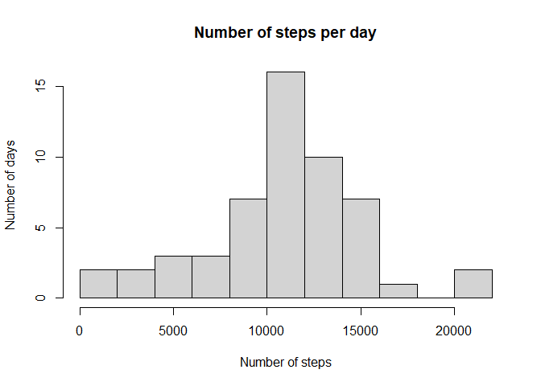
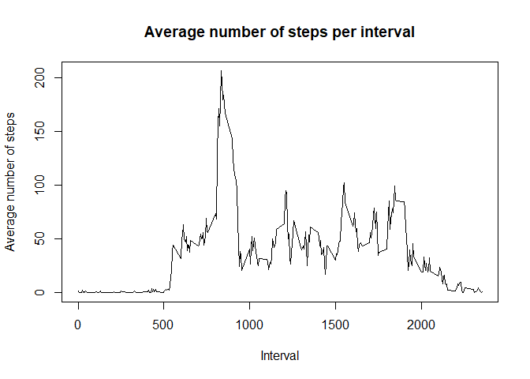
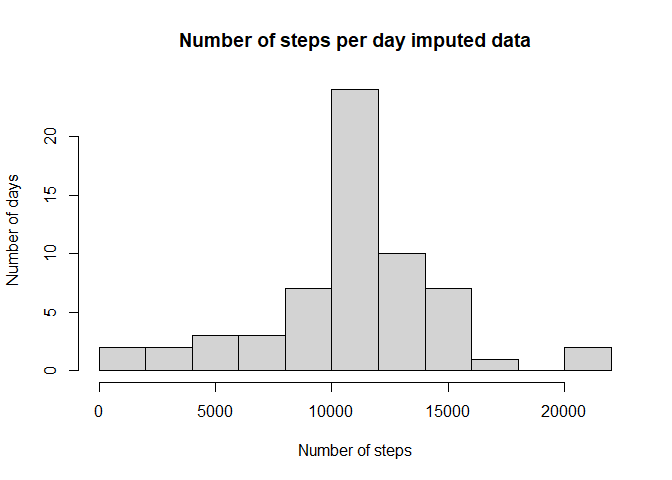
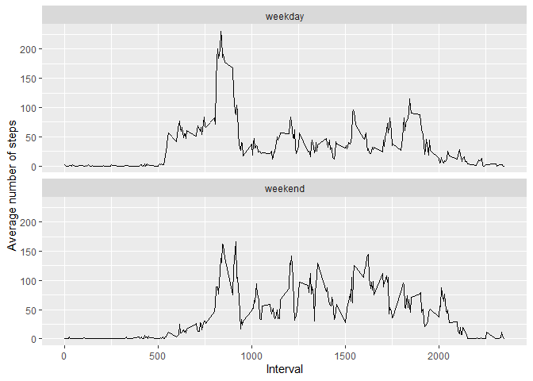

## Loading and preprocessing the data

```r
unzip("activity.zip")
raw_data <- read.csv("activity.csv")
```

## What is mean total number of steps taken per day?

```r
summed_data <- with(raw_data, aggregate(steps, list(date), FUN=sum))
hist(summed_data$x, main = "Number of steps per day", 
    xlab = "Number of steps", ylab = "Number of days", 
    breaks = 10)
```

<!-- -->

The mean for the dataset is:

```r
mean(summed_data$x, na.rm = TRUE)
```

```
## [1] 10766.19
```

The median for the dataset is 

```r
median(summed_data$x, na.rm = TRUE)
```

```
## [1] 10765
```
## What is the average daily activity pattern?

```r
avg_data <- with(na.omit(raw_data), 
    aggregate(steps, list(interval), FUN = mean))
plot(avg_data, type ="l", main="Average number of steps per interval",
    xlab = "Interval", ylab = "Average number of steps")
```

<!-- -->

The interval with the highest average number of steps is:


```r
avg_data[which.max(avg_data$x),]$Group.1
```

```
## [1] 835
```

## Imputing missing values

The total number of missing values is:

```r
sum(is.na(raw_data$steps))
```

```
## [1] 2304
```

Creating a new dataset with the missing values replaced with the average
value for that time interval.


```r
avg_data <- with(na.omit(raw_data), 
    aggregate(steps, list(interval), FUN = mean))
new_data <- cbind(raw_data, avg_data$x)
names(new_data)[4] <- "average"

for( i in 1:length(new_data$steps)){
    if(is.na(new_data[i,]$steps)){
        new_data[i,]$steps <- new_data[i,]$average
    }
}
```

The new plots and calculations for the data set are as follows:


```r
summed_data <- with(new_data, aggregate(steps, list(date), FUN=sum))
hist(summed_data$x, main = "Number of steps per day imputed data", 
    xlab = "Number of steps", ylab = "Number of days", 
    breaks = 10)
```

<!-- -->

The mean for the new dataset is:

```r
mean(summed_data$x)
```

```
## [1] 10766.19
```

The median for the new dataset is 

```r
median(summed_data$x)
```

```
## [1] 10766.19
```
## Are there differences in activity patterns between weekdays and weekends?

Split weekday and weekend activity data:


```r
new_data$day <- weekdays(as.Date(new_data$date))
weekdays <- c('Monday', 'Tuesday', 'Wednesday', 'Thursday', 'Friday')
new_data$wDay <- factor((new_data$day %in% weekdays), levels=c(FALSE, TRUE), 
    labels=c('weekend', 'weekday'))

weekdayData <- with(subset(new_data, wDay == 'weekday'), 
    aggregate(steps, list(interval), FUN = mean))
weekdayData$wDay <- ('weekday')
names(weekdayData) <- c('Interval', 'Steps', 'wDay')

weekendData <- with(subset(new_data, wDay == 'weekend'), 
    aggregate(steps, list(interval), FUN = mean))
weekendData$wDay <- ('weekend')
names(weekendData) <- c('Interval', 'Steps', 'wDay')

total_data <- rbind(weekendData, weekdayData)
```

Graphical output

```r
p <- ggplot(data = total_data, aes(x = Interval, y = Steps)) + geom_line()
p <- p + facet_wrap(~wDay, ncol = 1)
p + labs(x = "Interval", y = "Average number of steps")
```

<!-- -->

Graphs indicate that there is a clear difference in activity between weekdays
and weekends. In particular, 
